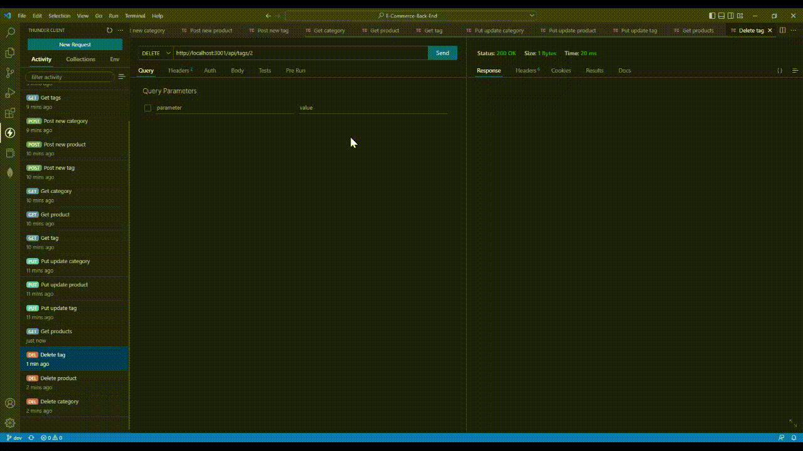

# E-Commerce-Back-End
> Express and Sequelize based back-end for an Internet retail site.

<div id="top"></div>

<!-- TABLE OF CONTENTS -->
<details>
  <summary>Table of Contents</summary>
  <ol>
    <li>
      <a href="#about-the-project">About The Project</a>
      <ul>
        <li><a href="#technologies-used">Technologies Used</a></li>
      </ul>
    </li>
    <li><a href="#installation">Installation</a></li>
    <li><a href="#usage">Usage</a></li>
    <li><a href="#contributors">Contributors</a></li>
  </ol>
</details>


<!-- ABOUT THE PROJECT -->
## About The Project
A complete API for accessing an SQL database designed for an e-commerce site with data such as information on products, categories, and tags.

<p align="right">(<a href="#top">back to top</a>)</p>

### Technologies Used

* [Node.js](https://nodejs.org/en/)
* [Express](https://expressjs.com/)
* [mySQL](https://mysql.com/)
* [Sequelize](https://sequelize.org/)

<p align="right">(<a href="#top">back to top</a>)</p>

## Installation

1. Properly install and configure mySQL.
    See the [mySQL Installation Guide](https://dev.mysql.com/doc/mysql-installation-excerpt/5.7/en/) for installation help.
2. Clone the repo
   ```sh
   git clone https://github.com/kwlucas/E-Commerce-Back-End.git
   ```
3. Install NPM packages
   ```sh
   npm install
   ```
4. To run locally create a ".env" file in the root directory with the following data
   ```js
   DB_NAME='ecommerce_db'
   DB_USER='yourUserHere' //your SQL user (use 'root' if you are not sure of another user you can use)
   DB_PASSWORD='YourPasswordHere' //The password for your SQL user
   ```
5. Use mySQL to run the "schema.sql" file within the "db" directory
   ```sh
   mysql> SOURCE ./db/schema.sql;
   ```
<p align="right">(<a href="#top">back to top</a>)</p>


<!-- USAGE EXAMPLES -->
## Usage

Run ```npm start``` in the console to start the application (If running locally).

Send requests to the API endpoints using your preferred method.

GET "/api/categories" will return information on all the categories including the products within them.

GET "/api/products" will return the data on all the products including the tags on them.

GET "/api/tags" will return the data on all the tags including the products the tags are on.


POST "/api/categories" will create a new category. The body of the request should contain the same properties as the following example.
```json
{
    "category_name": "socks"
}
```

POST "/api/products" will create a new product. The body of the request should contain the same properties as the following example.
```json
{
  "product_name": "Plain Socks",
  "price": 6.99,
  "stock": 15,
  "category_id": 6,
  "tagIds": [6]
}
```

POST "/api/tags" will create a new tag. The body of the request should contain the same properties as the following example.
```json
{
  "tag_name": "Black"
}
```


GET "/api/categories/ID_NUMBER" will return the data of the category with the specified ID.

GET "/api/products/ID_NUMBER" will return the data of the product with the specified ID.

GET "/api/tags/ID_NUMBER" will return the data of the tag with the specified ID


PUT "/api/categories/ID_NUMBER" will update the category with the specified ID. The body of the request should contain the properties that are to be updated with new values such as in the following example.
```json
{
    "category_name": "Socks"
}
```

PUT "/api/products/ID_NUMBER" will update the product with the specified ID. The body of the request should contain the properties that are to be updated with new values such as in the following example.
```json
{
  "product_name": "Plain Socks",
  "price": 5.99,
  "tagIds": [6, 9]
}
```

PUT "/api/tags/ID_NUMBER" will update the tag with the specified ID. The body of the request should contain the properties that are to be updated with new values such as in the following example.
```json
{
  "tag_name": "black"
}
```


DELETE "/api/categories/ID_NUMBER" will delete the data of the category with the specified ID.

DELETE "/api/products/ID_NUMBER" will delete the data of the product with the specified ID.

DELETE "/api/tags/ID_NUMBER" will delete the data of the tag with the specified ID



<p align="right">(<a href="#top">back to top</a>)</p>


<!-- CONTACT -->
## Contributors

* [Kyle Lucas](https://github.com/kwlucas)

Project link: [Repository](https://github.com/kwlucas/E-Commerce-Back-End)

<p align="right">(<a href="#top">back to top</a>)</p>
